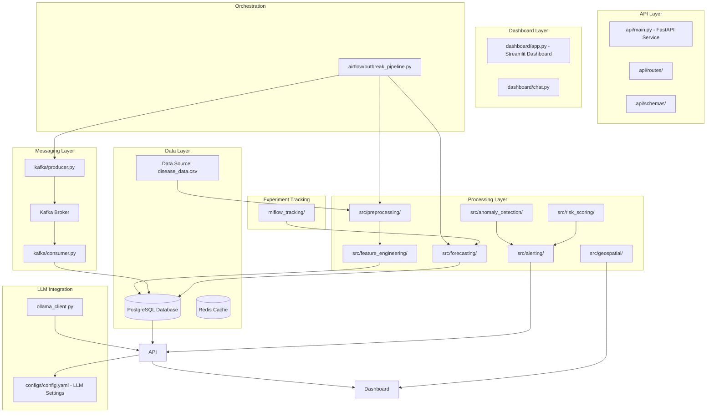

# EpiPulse AI Architecture and Component Overview

## Overview

EpiPulse AI is a public-health analytics platform for tracking disease case trends, detecting outbreak spikes, forecasting short-term case counts, and estimating regional risk. The system integrates machine learning models, an Airflow-orchestrated Kafka + Postgres pipeline, a FastAPI backend, an interactive Streamlit dashboard, and a retrieval-augmented LLM chat.

The platform processes synthetic disease data across 8 Indian regions (Delhi, Mumbai, Bengaluru, Chennai, Kolkata, Hyderabad, Ahmedabad, Pune) with features including cases, temperature, humidity, and rainfall. It provides anomaly detection, forecasting, risk scoring, geospatial visualization, and LLM-powered explanations.

## Architecture Diagram

## Core Components and File Descriptions

### Configuration Layer
- **`configs/config.yaml`**: Central configuration file containing all application settings including data paths, API ports, database connections, ML model parameters, thresholds for anomaly detection and risk scoring, Kafka settings, MLflow configuration, LLM settings, and geospatial coordinates for each region.

### Data Layer
- **`data/disease_data.csv`**: Primary data source containing synthetic disease case data with columns: date, region, cases, temperature, humidity, rainfall.
- **`database/db_connection.py`**: SQLAlchemy database engine factory for creating database connections.
- **`database/db.py`**: Enterprise SQLAlchemy session and base setup for database operations.
- **`database/models.py`**: Database table models defining the schema for storing processed data.

### Processing and ML Layer
- **`src/preprocessing/clean_data.py`**: Loads CSV data, removes duplicates, fills missing numeric values, and parses dates.
- **`src/preprocessing/feature_engineering.py`**: Creates region-wise rolling averages, lag features, and growth-rate calculations.
- **`src/preprocessing/preprocess.py`**: Main preprocessing pipeline combining cleaning and feature engineering.
- **`src/anomaly_detection/detect_spikes.py`**: Implements z-score based spike detection for outbreak identification.
- **`src/anomaly_detection/isolation_forest_detector.py`**: Multivariate anomaly detection using Isolation Forest algorithm.
- **`src/forecasting/arima_model.py`**: ARIMA time series forecasting model for case predictions.
- **`src/forecasting/prophet_model.py`**: Facebook Prophet forecasting model for trend analysis.
- **`src/forecasting/predict_cases.py`**: Unified forecasting interface combining multiple models.
- **`src/deep_learning/lstm_model.py`**: LSTM sequence preparation and model-building utilities for deep learning forecasts.
- **`src/risk_scoring/risk_score.py`**: Calculates normalized regional risk scores based on cases, humidity, and rainfall with configurable weights.
- **`src/alerting/alert_generator.py`**: Generates outbreak alerts based on risk scores, z-scores, and growth rates.
- **`src/alerting/alerts.py`**: Alert management and notification utilities.
- **`src/geospatial/heatmap.py`**: Generates interactive regional outbreak heatmaps using Folium.
- **`src/visualization/plots.py`**: Creates disease case trend plots by region using Matplotlib/Seaborn.

### API Layer
- **`api/main.py`**: FastAPI application providing REST endpoints for data access, risk assessment, spike detection, forecasting, and LLM-powered explanations. Includes Prometheus metrics integration.
- **`api/routes/prediction_routes.py`**: Additional API routes for advanced prediction endpoints.
- **`api/routes/__init__.py`**: Route module initialization.
- **`api/schemas/prediction_schema.py`**: Pydantic schemas for API request/response validation.
- **`api/schemas/__init__.py`**: Schema module initialization.

### Dashboard Layer
- **`dashboard/app.py`**: Streamlit web application providing interactive dashboard with region filters, case trend charts, risk visualization, and forecasting projections.
- **`dashboard/chat.py`**: Chat interface component for the dashboard.

### Messaging and Streaming
- **`kafka/producer.py`**: Kafka producer for publishing disease event data to message streams.
- **`kafka/consumer.py`**: Kafka consumer with a bounded `consume_and_persist()` used by the Airflow `consume_to_postgres` task to write events into PostgreSQL.

### Orchestration and Workflow
- **`airflow/outbreak_pipeline.py`**: Apache Airflow DAG (`epipulse_pipeline`) threading Kafka + Postgres through preprocessing, spike detection, and forecasting.
- **`database/ingest.py`**: Truncates `disease_records` and reloads from the CSV; called by the `seed_postgres` Airflow task.

### Experiment Tracking
- **`mlflow_tracking/train_with_tracking.py`**: MLflow benchmark that trains ARIMA and Prophet on a train window and logs MAE/RMSE against a held-out 30-day window per region.

### LLM Integration
- **`src/llm/llm_client.py`**: Unified `BaseLLMClient` with Groq and Ollama providers and model-fallback handling.
- **`src/llm/ollama_client.py`**: Ollama-specific implementation.
- **`src/rag/knowledge_base.py`**: ChromaDB + sentence-transformers store seeded with WHO/IDSP guidance.
- **`src/rag/retriever.py`**: Retrieves top-k chunks and builds citation-aware LLM prompts.

### Utilities
- **`src/utils/config.py`**: Configuration loading and path resolution utilities.
- **`src/utils/logger.py`**: Reusable logging setup with file rotation.

### Testing
- **`tests/test_api_routes.py`**: Unit tests for API endpoints.
- **`tests/test_core_workflows.py`**: Tests for core data processing workflows.
- **`tests/test_llm_client.py`**: Tests for LLM client functionality.

### Notebooks
- **`notebooks/lesson_01_project_overview.ipynb`**: Introduction to the project and data.
- **`notebooks/lesson_02_data_and_preprocessing.ipynb`**: Data loading and preprocessing walkthrough.
- **`notebooks/lesson_03_feature_engineering_and_risk.ipynb`**: Feature engineering and risk scoring.
- **`notebooks/lesson_04_anomaly_detection.ipynb`**: Spike and anomaly detection methods.
- **`notebooks/lesson_05_forecasting.ipynb`**: Time series forecasting with ARIMA and Prophet.
- **`notebooks/lesson_06_dashboard_and_api.ipynb`**: Building the dashboard and API.
- **`notebooks/lesson_07_alerting_geospatial_and_docker.ipynb`**: Alerting and geospatial visualization walkthrough.
- **`notebooks/lesson_08_enterprise_layer.ipynb`**: Enterprise features including Kafka, Airflow, and MLflow.

### Dependencies and Requirements
- **`requirements.txt`**: Core Python dependencies for the application.
- **`requirements-dev.txt`**: Development and testing dependencies.
- **`requirements-enterprise.txt`**: Enterprise features dependencies (Kafka, Airflow, MLflow, etc.).

## Data Flow and Component Connections

1. **Data Ingestion**: Raw CSV data is loaded and cleaned by `src/preprocessing/clean_data.py`.

2. **Feature Engineering**: Cleaned data is enhanced with rolling averages, lags, and growth rates in `src/preprocessing/feature_engineering.py`.

3. **Storage**: Processed data is stored in PostgreSQL via SQLAlchemy models in `database/`.

4. **API Serving**: FastAPI in `api/main.py` serves data through REST endpoints, computing risk scores, detecting spikes, and providing forecasts on-demand.

5. **Dashboard Visualization**: Streamlit dashboard in `dashboard/app.py` fetches data from the API and displays interactive charts and maps.

6. **Real-time Processing**: Kafka producer publishes events, consumer processes them and updates the database.

7. **Batch Processing**: Airflow orchestrates daily pipelines for preprocessing, forecasting, and model updates.

8. **ML Experimentation**: MLflow tracks forecasting experiments and model performance.

9. **LLM Enhancement**: Ollama client provides AI-powered explanations for alerts and insights.

10. **Monitoring**: Centralized logging and metrics collection for observability.

## Technologies Used

- **Backend**: Python, FastAPI, SQLAlchemy
- **Database**: PostgreSQL
- **Cache**: Redis
- **Messaging**: Apache Kafka, Zookeeper
- **Orchestration**: Apache Airflow
- **ML Frameworks**: scikit-learn, statsmodels, prophet, TensorFlow/Keras
- **Visualization**: Streamlit, Plotly, Matplotlib, Folium
- **LLM**: Groq (cloud) and Ollama (local)
- **RAG**: ChromaDB + sentence-transformers
- **Experiment Tracking**: MLflow
- **Monitoring**: Prometheus metrics endpoint
- **Development**: Jupyter Notebooks, pytest

## Key Workflows

### Outbreak Detection Pipeline
1. Data preprocessing and feature engineering
2. Anomaly detection using z-score and Isolation Forest
3. Risk scoring based on multiple factors
4. Alert generation with LLM explanations
5. Geospatial heatmap generation

### Forecasting Pipeline
1. Time series analysis with ARIMA and Prophet
2. Model training and validation
3. Forecast generation for next 7 days
4. MLflow experiment tracking

### Real-time Data Processing
1. Kafka producer streams disease events
2. Consumer processes and stores in database
3. API serves real-time metrics and alerts

### Dashboard Interaction
1. User selects region and date range
2. API fetches filtered data
3. Dashboard renders charts and maps
4. LLM provides contextual explanations

This architecture provides a modular system for epidemic intelligence combining batch analytics, streaming ingest, and retrieval-augmented explanations.